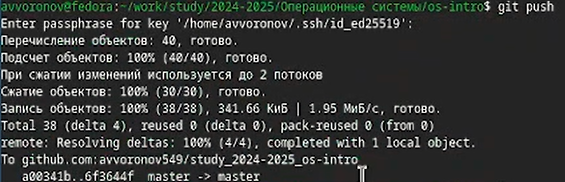

---
## Front matter
lang: ru-RU
title: Отчет по лабораторной работе №2
subtitle: Операционные системы
author:
  - Воронов А.В.
institute:
  - Российский университет дружбы народов, Москва, Россия

## i18n babel
babel-lang: russian
babel-otherlangs: english

## Formatting pdf
toc: false
toc-title: Содержание
slide_level: 2
aspectratio: 169
section-titles: true
theme: metropolis
header-includes:
 - \metroset{progressbar=frametitle,sectionpage=progressbar,numbering=fraction}
---

# Информация

## Докладчик

:::::::::::::: {.columns align=center}
::: {.column width="70%"}

  * Воронов Александр Валерьевич
  * НКАбд-01-2024 № Студенческого билета: 1132243812
  * Российский университет дружбы народов
  * <https://github.com/avvoronov549/study_2024-2025_os-intro>

:::
::: {.column width="30%"}

:::
::::::::::::::

# Цель работы

Целью данной работы является изучение идеологии и применения средств контроля версий и освоение умения по работе с git.

# Задание

1. Создать базовую конфигурацию для работы с git.
2. Создать ключ SSH.
3. Создать ключ PGP.
4. Настроить подписи git.
5. Зарегистрироваться на Github.
6. Создать локальный каталог для выполнения заданий по предмету.

# Теоретическое введение

Системы контроля версий (Version Control System, VCS) применяются при работе нескольких человек над одним проектом. Обычно основное дерево проекта хранится в локальном или удалённом репозитории, к которому настроен доступ для участников проекта. При внесении изменений в содержание проекта система контроля версий позволяет их фиксировать, совмещать изменения, произведённые разными участниками проекта, производить откат к любой более ранней версии проекта, если это требуется.

# Выполнение лабораторной работы

## Установка git и gh

Установим гит командой dnf install git, установим gh командой dnf install gh

## Базовая настройка git.

Задаем имя и email владельца репозитория, настраиваем utf-8 в выводе сообщений.

{#fig:001 width=70%}

## Создание ssh ключа.

Создание и добавление SSH ключа на github.

{#fig:002 width=70%}

## Создание PGP ключа.

Генерируем GPG ключ.

{#fig:003 width=70%}

##

Копируем GPG в буфер обмена.

{#fig:004 width=70%}

## Добавление ключа на ГитХаб.

Добавляем GPG ключ на github.

{#fig:005 width=70%}

## Настройка автоматических подписей коммитов git

Используем введенный email, указывая git где будут применять его при подписи коммитов.

{#fig:006 width=70%}

## Настройка gh

Авторизуемся с помощью gh auth login.

{#fig:007 width=70%}

## Создание и настройка репозитория курса.

Создаем репозиторий курса на основе шаблона.

{#fig:008 width=70%}

Отправляем файлы первой лабораторной работы на сервер.

##

Отправляем файлы на сервер.

{#fig:010 width=70%}

# Вывод

В результате выполнения данной лабораторной работы я приобрел необходимые навыки работы с гит, научился созданию репозиториев, gpg и ssh ключей, настроил каталог курса и  авторизовался в gh.
