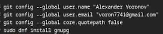
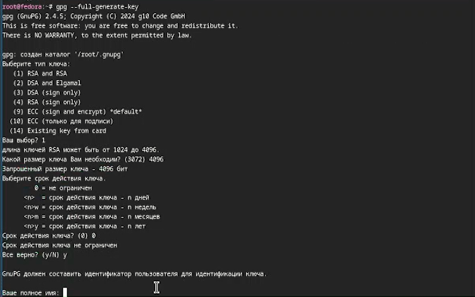
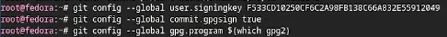
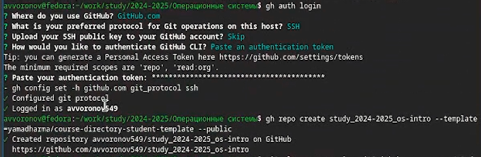
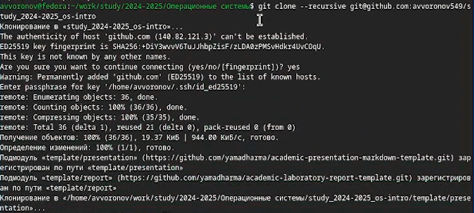
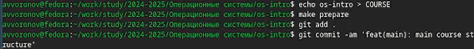
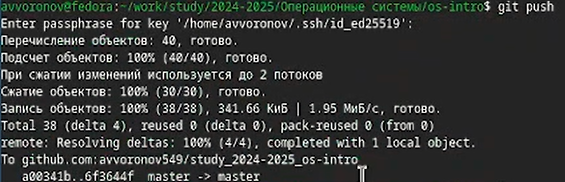

---
## Front matter
title: "Отчёт по лабораторной №2"
subtitle: "Дисциплина: Операционные системы"
author: "Воронов Александр Валерьевич"

## Generic otions
lang: ru-RU
toc-title: "Содержание"

## Bibliography
bibliography: bib/cite.bib
csl: pandoc/csl/gost-r-7-0-5-2008-numeric.csl

## Pdf output format
toc: true # Table of contents
toc-depth: 2
lof: true # List of figures
lot: true # List of tables
fontsize: 12pt
linestretch: 1.5
papersize: a4
documentclass: scrreprt
## I18n polyglossia
polyglossia-lang:
  name: russian
  options:
	- spelling=modern
	- babelshorthands=true
polyglossia-otherlangs:
  name: english
## I18n babel
babel-lang: russian
babel-otherlangs: english
## Fonts
mainfont: IBM Plex Serif
romanfont: IBM Plex Serif
sansfont: IBM Plex Sans
monofont: IBM Plex Mono
mathfont: STIX Two Math
mainfontoptions: Ligatures=Common,Ligatures=TeX,Scale=0.94
romanfontoptions: Ligatures=Common,Ligatures=TeX,Scale=0.94
sansfontoptions: Ligatures=Common,Ligatures=TeX,Scale=MatchLowercase,Scale=0.94
monofontoptions: Scale=MatchLowercase,Scale=0.94,FakeStretch=0.9
mathfontoptions:
## Biblatex
biblatex: true
biblio-style: "gost-numeric"
biblatexoptions:
  - parentracker=true
  - backend=biber
  - hyperref=auto
  - language=auto
  - autolang=other*
  - citestyle=gost-numeric
## Pandoc-crossref LaTeX customization
figureTitle: "Рис."
tableTitle: "Таблица"
listingTitle: "Листинг"
lofTitle: "Список иллюстраций"
lotTitle: "Список таблиц"
lolTitle: "Листинги"
## Misc options
indent: true
header-includes:
  - \usepackage{indentfirst}
  - \usepackage{float} # keep figures where there are in the text
  - \floatplacement{figure}{H} # keep figures where there are in the text
---

# Цель работы
Изучить идеологию и применение средств контроля версий
Освоить умения по работе с git
# Задание
1. Создать базовую конфигурацию для работы с git.
2. Создать ключ SSH
3. Создать ключ PGP.
4. Настроить подписи git.
5. Зарегистрироваться на Github.
6. Создать локальный каталог для выполнения заданий по предмету.

# Теоретическое введение
Системы контроля версий (Version Control System, VCS) применяются при работе нескольких человек над одним проектом. Обычно основное дерево проекта хра
В классических системах контроля версий используется централизованная модель, предполагающая наличие единого репозитория для хранения файлов. Выполнен
                                                                                                                                                      
Системы контроля версий поддерживают возможность отслеживания и разрешения конфликтов, которые могут возникнуть при работе нескольких человек над одни
                                                                                                                                                      
Системы контроля версий также могут обеспечивать дополнительные, более гибкие функциональные возможности. Например, они могут поддерживать работу с не
                                                                                                                                                      
В отличие от классических, в распределённых системах контроля версий центральный репозиторий не является обязательным.
                                                                                                                                                      
Среди классических VCS наиболее известны CVS, Subversion, а среди распределённых — Git, Bazaar, Mercurial. Принципы их работы схожи, отличаются они в 
            
# Выполнение лабораторной работы

Задаем имя и email владельца репозитория, настраиваем utf-8 в выводе сообщений(рис.[-@fig:001])

{#fig:001 width=70%}

Создание и добавление SSH ключа на github(рис.[-@fig:002])

{#fig:002 width=70%}

Генерируем GPG ключ(рис.[-@fig:003])

{#fig:003 width=70%}

Копируем GPG в буфер обмена(рис.[-@fig:004])

{#fig:004 width=70%}

Добавляем GPG ключ на github(рис.[-@fig:005])

{#fig:005 width=70%}

Используем введенный email, указывая git где будут применять его при подписи коммитов(рис. [-@fig:006])

{#fig:006 width=70%}

Авторизуемся с помощью gh auth login(рис.[-@fig:007])

{#fig:007 width=70%}

Создаем репозиторий курса на основе шаблона(рис.[-@fig:008])

{#fig:008 width=70%}

Создаем необходимые каталоги(рис.[-@fig:009])

{#fig:009 width=70%}

Отправляем файлы на сервер(рис.[-@fig:010])

{#fig:010 width=70%}

# Контрольные вопросы
Что такое системы контроля версий (VCS) и для решения каких задач они предназначаются?
                                                                                                                        
Система контроля версий — программное обеспечение для облегчения работы с изменяющейся информацией. Система управления в
ерсиями позволяет хранить несколько версий одного и того же документа, при необходимости возвращаться к более ранним вер
сиям, определять, кто и когда сделал то или иное изменение, и многое другое. Системы контроля версий (Version Control Sy
stem, VCS) применяются для:
Хранение полной истории изменений причин всех производимых изменений
Откат изменений, если что-то пошло не так
Поиск причины и ответственного за появления ошибок в программе
Совместная работа группы над одним проектом
Возможность изменять код, не мешая работе других пользователей

2. Объясните следующие понятия VCS и их отношения: хранилище, commit, история, рабочая копия
                                                                                                                        
Репозиторий - хранилище версий - в нем хранятся все документы вместе с историей их изменения и другой служебной информац
ией.Commit — отслеживание изменений
Рабочая копия - копия проекта, связанная с репозиторием (текущее состояние файлов проекта, основанное на версии из храни
лища (обычно на последней)
История хранит все изменения в проекте и позволяет при необходимости обратиться к нужным данным.
                                                                                                                        
3. Что представляют собой и чем отличаются централизованные и децентрализованные VCS? Приведите примеры VCS каждого вида
                                                                                                                        
Централизованные VCS (Subversion; CVS; TFS; VAULT; AccuRev):
Одно основное хранилище всего проекта
Каждый пользователь копирует себе необходимые ему файлы из этого репозитория, изменяет и, затем, добавляет свои изменени
я обратно Децентрализованные VCS (Git; Mercurial; Bazaar):
У каждого пользователя свой вариант (возможно не один) репозитория
Присутствует возможность добавлять и забирать изменения из любого репозитория . В классических системах контроля версий 
используется централизованная модель, предполагающая наличие единого репозитория для хранения файлов. Выполнение большин
ства функций по управлению версиями осуществляется специальным сервером. В отличие от классических, в распределённых сис
темах контроля версий центральный репозиторий не является обязательным.
                                                                                                                        
4. Опишите действия с VCS при единоличной работе с хранилищем.
                                                                                                                        
Сначала создаем и подключаем удаленный репозиторий. Затем по мере изменения проекта отправлять эти изменения на сервер. 
                                                                                                                        
5. Опишите порядок работы с общим хранилищем VCS.
                                                                                                                        
Участник проекта (пользователь) перед началом работы посредством определённых команд получает нужную ему версию файлов. 
После внесения изменений, пользователь размещает новую версию в хранилище. При этом предыдущие версии не удаляются из це
нтрального хранилища и к ним можно вернуться в любой момент.

6. Каковы основные задачи, решаемые инструментальным средством git?
                                                                                                                        
Первая — хранить информацию о всех изменениях в вашем коде, начиная с самой первой строчки, а вторая — обеспечение удобс
тва командной работы над кодом.
                                                                                                                        
7. Назовите и дайте краткую характеристику командам git.

Наиболее часто используемые команды git: создание основного дерева репозитория: git init • получение обновлений (измен
ений) текущего дерева из центрального репозитория: git pull отправка всех произведённых изменений локального дерева в 
центральный репозиторий: git push • просмотр списка изменённых файлов в текущей директории: git status • просмотр текущи
х изменения: git diff • сохранение текущих изменений: – добавить все изменённые и/или созданные файлы и/или каталоги: gi
t add. – добавить конкретные изменённые и/или созданные файлы и/или каталоги: git add имена_файлов • удалить файл и/или 
каталог из индекса репозитория (при этом файл и/или каталог остаётся в локальной директории): git rm имена_файлов • сохр
анение добавленных изменений: – сохранить все добавленные изменения и все изменённые файлы: git commit -am ‘Описание ком
мита’ – сохранить добавленные изменения с внесением комментария через встроенный редактор git commit • создание новой ве
тки, базирующейся на текущей: git checkout -b имя_ветки переключение на некоторую ветку: git checkout имя_ветки (при п
ереключении на ветку, которой ещё нет в локальном репозитории, она будет создана и связана с удалённой) • отправка измен
ений конкретной ветки в центральный репозиторий: git push origin имя_ветки слияние ветки с текущим деревом: git merge 
–no-ff имя_ветки удаление ветки: – удаление локальной уже слитой с основным деревом ветки: git branch -d имя_ветки – п
ринудительное удаление локальной ветки: git branch -D имя_ветки – удаление ветки с центрального репозитория: git push or
igin :имя_ветки
                                                                                                                        
8. Приведите примеры использования при работе с локальным и удалённым репозиториями.
                                                                                                                        
git push –all (push origin master/любой branch)
                                                                                                                        
9. Что такое и зачем могут быть нужны ветви (branches)?
                                                                                                                        
Ветвление («ветка», branch) — один из параллельных участков истории в одном хранилище, исходящих из одной версии (точки 
ветвления). [3]Обычно есть главная ветка (master), или ствол (trunk). Между ветками, то есть их концами, возможно с
лияние. Используются для разработки новых функций.
                                                                                                                        
10. Как и зачем можно игнорировать некоторые файлы при commit?
                                                                                                                        
Во время работы над проектом так или иначе могут создаваться файлы, которые не требуется добавлять в последствии в репоз
иторий. Например, временные файлы, создаваемые редакторами, или объектные файлы, создаваемые компиляторами. Можно пропис
ать шаблоны игнорируемых при добавлении в репозиторий типов файлов в файл .gitignore с помощью сервисов.
# Выводы

В результате выполнения лаюораторной работы я приобрел навыки работы с гит, научился созданию репозиториев, gpg и ssh ключей, настроил каталог курса и авторизовался в gh.

# Список литературы{.unnumbered}

